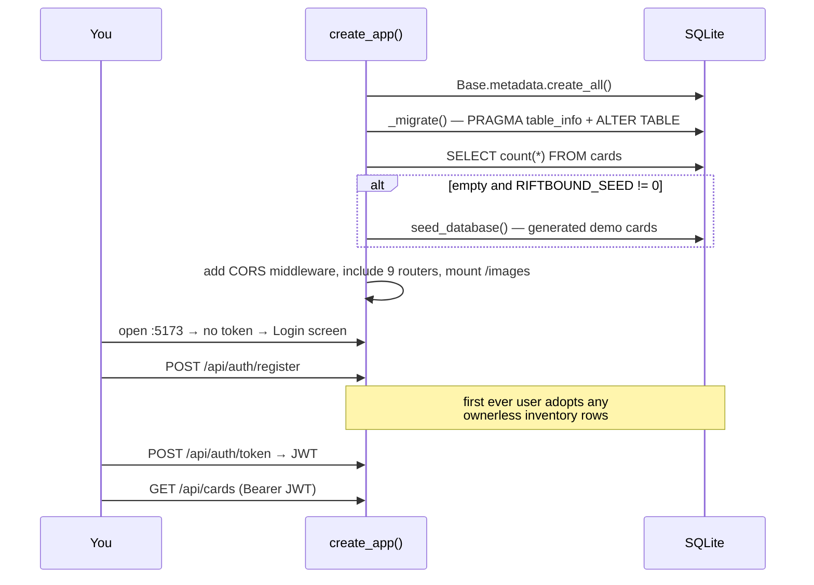

[← Docs index](README.md)

# 1. Getting started

Goal: a running stack with real card data and a logged-in account, in about ten minutes.

---

## Option A — Docker (fewest moving parts)

Requires [Docker Desktop](https://www.docker.com/products/docker-desktop/).

```bash
docker compose up --build          # dev: hot reload, Vite on :5173
```

Open <http://localhost:5173>. Then load the real card catalog:

```bash
docker compose exec backend python -m app.ingest.fetch_official
```

The production-shaped stack (nginx serving a built bundle on one port) is:

```bash
docker compose --profile prod up --build     # → http://localhost:8080
```

Use the prod profile whenever you change routing, static-asset handling, or anything
that behaves differently under a real reverse proxy — the Vite dev server's SPA
fallback hides a class of bugs that only nginx surfaces.

---

## Option B — Local (better for debugging)

**Terminal 1 — backend:**

```powershell
cd backend
python -m venv .venv
.venv\Scripts\pip install -r requirements.txt
.venv\Scripts\python -m uvicorn app.main:app --port 8000 --reload
```

**Terminal 2 — frontend:**

```powershell
cd frontend
npm install
npm run dev              # http://localhost:5173
```

**Load real card data** (optional but recommended — otherwise you get ~30 generated
demo cards):

```powershell
cd backend
.venv\Scripts\python -m app.ingest.fetch_official            # all sets, ~950 cards
.venv\Scripts\python -m app.ingest.fetch_official --set UNL  # just one set, faster
```

Restart the backend afterwards so it picks up the new rows.

---

## First run: what actually happens



There is **no default account**. Register one from the login screen; the first
registration also claims any legacy inventory rows that predate multi-user support
(`routes/auth.py`).

---

## Where your data lives

| Path | What |
|---|---|
| `backend/data/riftbound.db` | Everything: catalog, all users' inventories, settings, decks, prices |
| `backend/data/images/` | Re-encoded card art, served at `/images/<file>` |
| `backend/data/secret.key` | Auto-generated JWT signing key (see [auth](04-authentication.md)) |

In Docker these are bind-mounted from the host, so they survive `--build`. **Deleting
`riftbound.db` wipes every account.** To start clean, delete the whole `data/` folder
and restart.

---

## Environment variables

All read in `backend/app/config.py` — that file is the single source of truth.

| Variable | Default | Purpose |
|---|---|---|
| `RIFTBOUND_DATA_DIR` | `backend/data` | Where the DB, images and key file live |
| `RIFTBOUND_CORS_ORIGINS` | `http://localhost:5173,https://localhost:5173` | Comma-separated allowed origins |
| `RIFTBOUND_SEED` | `1` | Set to `0` to skip demo seeding on an empty DB |
| `RIFTBOUND_JWT_SECRET` | *(generated → `data/secret.key`)* | HS256 signing key |
| `RIFTBOUND_TOKEN_EXPIRE_DAYS` | `30` | Token lifetime |
| `RIFTBOUND_PRICE_API_KEY` | *(unset)* | Enables market pricing; unset = feature reports "not configured" |
| `RIFTBOUND_PRICE_DAILY_BUDGET` | `90` | Max pricing-API requests per UTC day |
| `RIFTBOUND_PRICE_STALE_HOURS` | `24` | Cached price age that triggers a refresh |
| `RIFTBOUND_TOPDECK_KEY` | *(unset)* | Enables the TopDeck.gg community-deck provider |

Every external integration is **key-gated and degrades quietly**: with no key, pricing
returns `configured: false` and the rest of the app is unaffected. You never need a
key to develop.

**Where keys go.** For Docker, copy `.env.example` to `.env` in the repo root and fill
in what you have — Compose reads it automatically and passes the values through. For a
local backend, set them in your shell (`$env:RIFTBOUND_TOPDECK_KEY = "..."`). `.env` is
gitignored; never put a key in `docker-compose.yml` or any committed file.

---

## Verify your setup

```powershell
cd backend;  .venv\Scripts\python -m pytest      # backend suite
cd frontend; npm test                             # vitest
cd frontend; npm run build                        # tsc + vite build
```

Interactive API docs are at <http://localhost:8000/docs> — FastAPI generates them from
the route signatures and Pydantic models, so they are always in sync with the code.
Click **Authorize** and paste a token to try protected endpoints.

---

## Editor setup

- **Python** — point your interpreter at `backend/.venv`. There is no linter or
  formatter configured; match the surrounding style (4-space indent, type hints on
  public functions, docstrings that explain *why*).
- **TypeScript** — `npm run build` runs `tsc -b` in strict mode and is the type gate.
  There is no ESLint/Prettier config; match the surrounding style (2-space indent,
  double quotes, named exports from `lib/`, default exports from screens/components).

---

Next: [System design →](02-system-design.md)
