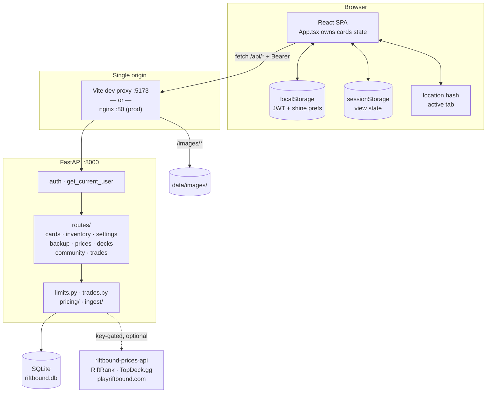
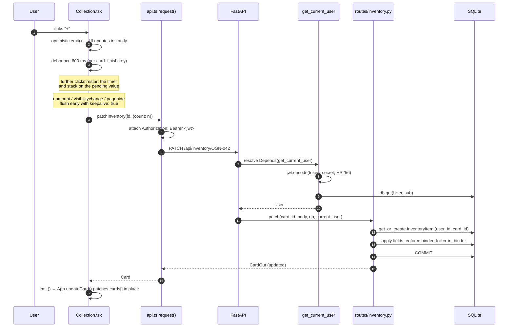

[← Docs index](README.md)

# 2. System design

This chapter explains the shape of the system and, more importantly, **why** it has that
shape. Every decision here was made for a specific reason; knowing the reason tells you
when it's safe to change.

---

## 2.1 The big picture

Three processes at most: a Python server, a static file server, and SQLite (in-process).
No message queue, no cache layer, no separate auth service. That is deliberate — see
below.

---

## 2.2 Design decisions and their rationale

### SQLite as the database

**Decision.** One file, `backend/data/riftbound.db`, holding every table.

**Why.** The workload is a handful of users on a machine someone runs at home. Write
volume is a few PATCHes per minute; read volume is one bulk `GET /api/cards` per page
load. SQLite is explicitly designed for this: it is the right choice for
"application file format" and low-to-medium traffic single-server apps, and it removes
an entire operational surface (no server to install, back up, secure, or version).
Backing up the collection is `cp riftbound.db`.

**When you'd change it.** Concurrent writers. SQLite serializes writes with a
database-level lock, so if this ever became a hosted multi-tenant service, PostgreSQL
would be the move. SQLAlchemy makes that mostly a connection-string change — but
`main._migrate()` and the `PRAGMA table_info` guards are SQLite-specific and would need
replacing with Alembic.

> - [SQLite: Appropriate uses for SQLite](https://sqlite.org/whentouse.html)
> - [SQLite: How SQLite is tested](https://sqlite.org/testing.html) — why "just a file" is trustworthy

### FastAPI + Pydantic

**Decision.** FastAPI for routing, Pydantic v2 models for every request and response.

**Why.** Validation, serialization, and OpenAPI documentation all fall out of the same
type annotations, so there is exactly one place a field is declared. Dependency
injection (`Depends`) is what makes `get_current_user` composable — auth is one
parameter on a route signature rather than middleware that has to re-parse paths.
`/docs` is generated, so the API reference can never drift from the code.

**The catch you must know.** A `response_model` is a *filter*: FastAPI serializes the
return value through it and **silently drops any field the model doesn't declare**.
That is a feature (it prevents accidental leaks — a route can return an ORM object with
a password hash and the schema will strip it) but it bites when you forget to add a
field. It already caused a live bug: [known issue #2](09-known-issues.md).

> - [FastAPI: Response Model](https://fastapi.tiangolo.com/tutorial/response-model/)
> - [FastAPI: Dependencies](https://fastapi.tiangolo.com/tutorial/dependencies/)
> - [Pydantic v2 docs](https://docs.pydantic.dev/latest/)

### One bulk endpoint instead of pagination

**Decision.** `GET /api/cards` returns the entire catalog (~950 rows) with the caller's
counts and limits already joined. The frontend filters, searches, and sorts in memory.

**Why.** The dataset is bounded and small — a full set release adds a few hundred rows,
not millions. One request means: instant filter/search with no loading spinners, no
server round-trip per keystroke, no cache-invalidation problem, and no N+1 queries
(`build_card_list` does two queries total regardless of catalog size). The payload is
a few hundred KB of JSON, which is smaller than a single card image.

**When you'd change it.** If the catalog reached tens of thousands of cards, or if you
added per-card data that made rows fat (full rules text, localizations). At that point,
paginate the *grid* but keep a lightweight bulk endpoint for the dashboard aggregates.

### Client-side filtering, server-side filter params

`GET /api/cards` also accepts `search`, `set_code`, `domain`, `rarity`, `card_type`, and
`owned` query params. The UI does not currently use them — `Collection.tsx` filters the
in-memory array. Both exist because the params are useful for scripts and for a future
paginated grid. Don't delete them; don't wire the UI to them without a reason.

### Same-origin by construction

**Decision.** The browser never makes a cross-origin request. Vite proxies `/api` and
`/images` to `localhost:8000` in dev (`vite.config.ts`); nginx proxies the same paths in
prod (`frontend/nginx.conf`).

**Why.** Three benefits at once: no CORS preflight round-trips, no API base URL compiled
into the bundle (so the same build works in dev, Docker, and prod), and cookies/headers
behave identically everywhere. CORS on the backend is *additionally* locked to the
frontend origin as defence in depth — the API mutates your collection, so an arbitrary
website must not be able to drive it from your browser.

> - [Vite: server.proxy](https://vitejs.dev/config/server-options.html#server-proxy)
> - [MDN: Cross-Origin Resource Sharing](https://developer.mozilla.org/en-US/docs/Web/HTTP/CORS)

### View state in the browser, not the server

**Decision.** Where the user is — active tab, filters, which collection they're browsing —
is stored client-side across three tiers: `location.hash` for the tab, `sessionStorage`
for everything else, `localStorage` for the token and rendering prefs. No server-side
session, no `user_view_state` table.

**Why.** None of it is worth a round-trip or a row. It's per-device by nature — the filters
you want on your phone aren't the ones you want on your desktop — and it must be readable
*before* the first paint, which a fetch can't be. The tiers differ only in lifetime:
`sessionStorage` is scoped to one browser tab and survives that tab being reloaded or
discarded and restored, which is exactly the lifetime a filter should have.

**The problem it solves.** Mobile browsers discard backgrounded tabs to reclaim memory and
re-run the document on return. The JWT survived that; nothing else did, so a phone that
slept came back logged in on the Overview tab with every filter reset. See
[frontend § durable view state](06-frontend.md#durable-view-state).

**When you'd change it.** If "resume where I left off" should follow a user *across*
devices, that becomes real server state — a per-user JSON blob in `settings`, alongside
limit rules and deck options, would be the shape to reach for.

> - [MDN: Window.sessionStorage](https://developer.mozilla.org/en-US/docs/Web/API/Window/sessionStorage)

### Stateless trade requests

**Decision.** Trades add **no database table**. The request is plain text that the
requester copies and the owner pastes.

**Why.** A trade is a real-world negotiation happening over Discord or in person; the
app's job is bookkeeping, not being the transport. Modelling it as a stateful entity
would demand invitations, accept/decline states, expiry, notifications, and a
reconciliation story for trades that happened offline — all to support a feature whose
actual requirement is "deduct these counts when the cards change hands."

The text format is human-readable *and* machine-parseable, which means it survives being
pasted into a chat window, hand-edited, or reconstructed from memory.

**The safety property that makes this sound:** `POST /api/trades/fulfil` only ever writes
to `current_user`'s rows, and clamps each deduction to what they actually hold. A stale,
forged, or hand-edited request therefore cannot drive a count negative or touch anyone
else's collection. The preview is *advisory*; the fulfil endpoint re-validates
everything. See [feature deep dives](07-feature-deep-dives.md#trade-requests).

### Writer and parser in one module

`backend/app/trades.py` contains both `format_request()` and `parse_request()`. Splitting
them across modules (or worse, across frontend and backend) is how serialization formats
drift. Keeping them adjacent means a round-trip test — `parse(format(x)) == x` — covers
the whole contract, and any change to one side is physically next to the other.

### Per-user settings as JSON in a key-value table

**Decision.** Limit rules and deck options are JSON blobs in the `settings` table, keyed
`"{user_id}:limit_rules"` and `"{user_id}:deck_options"`.

**Why.** These are preference documents, not relational data — nothing joins on them,
they are read whole and written whole, and their shape evolves as features are added.
A normalized table would need a migration for every new toggle. `get_rules()` merges the
stored blob over `DEFAULT_RULES`, so adding a key is a one-line change and existing rows
pick up the default automatically.

**The trade-off.** No schema enforcement at the DB level, and the merge deliberately
ignores unknown keys (`{k: stored[k] for k in stored if k in merged}`) so stale keys
from an older version can't resurrect. That last detail is why the Pydantic schema must
list every rule field — see [known issue #2](09-known-issues.md).

### Additive-only manual migrations

**Decision.** `main._migrate()` runs on every startup, checking `PRAGMA table_info` and
issuing `ALTER TABLE ... ADD COLUMN` for anything missing. No Alembic.

**Why.** `Base.metadata.create_all()` creates missing *tables* but never alters existing
ones, so schema changes to a live database need help. For an app where the database is a
file on the user's own machine, a migration tool with a version table and a revision
graph is more machinery than the problem justifies — and every migration so far has been
"add a nullable column with a default."

**The rules.** Additive only. Never drop a column, never change a type, never rename.
`ALTER TABLE ADD COLUMN` is cheap in SQLite (metadata-only) and the `PRAGMA` guard makes
it idempotent. If you ever need a destructive change, you need Alembic — say so in the PR
rather than hand-rolling it.

> - [SQLite: ALTER TABLE](https://www.sqlite.org/lang_altertable.html)
> - [Alembic](https://alembic.sqlalchemy.org/) — what you'd adopt if this stops being enough

### Optional integrations degrade quietly

Pricing, TopDeck.gg decks, and Scrydex ingest are all gated on an environment variable.
With no key: the pricing endpoints return `configured: false`, the deck provider is
skipped, and every other feature is untouched. Nothing crashes, nothing 500s, and the
test suite runs without network access.

This pattern is worth copying for any new integration: **check the key, return a
"not configured" shape, never raise.**

### Daily budget for the pricing API

The free tier allows 100 requests/day, so `pricing/budget.py` tracks spend in a
`price_api_usage` row per UTC date and refuses to exceed `PRICE_DAILY_BUDGET` (default
90, leaving headroom). `GET /api/prices/summary` — the endpoint the grid calls — **never**
triggers a refresh; it serves whatever is cached. Only viewing a single card
(`GET /api/prices/{id}`) can spend budget, and only if that card's price is stale.

This is rate limiting as a *correctness* concern rather than a politeness one: exceeding
the quota would break the feature for the rest of the day.

---

## 2.3 Request lifecycle

Trace a single count increment end to end:

Two things to notice:

1. **The optimistic update happens before the network call**, and a failure reverts to
   the pre-click card. The user never waits on the server to see their click land.
2. **The response is the updated card, not `204 No Content`.** That is what lets
   `App.updateCard()` patch one array element instead of refetching 950 cards. Every
   mutating route in this codebase follows that convention — keep it.

---

## 2.4 Security posture

| Concern | Mitigation | Where |
|---|---|---|
| Cross-user data access | Every query filters on `current_user.id`; `InventoryItem` PK is `(user_id, card_id)` | all `routes/` |
| Unauthenticated access | `Depends(get_current_user)` on every route outside `/api/auth/*` | `auth.py` |
| Password storage | bcrypt with a SHA-256 pre-hash (avoids bcrypt's 72-byte truncation) | `auth.py` |
| SQL injection | SQLAlchemy ORM parameter binding throughout; no string-built SQL | everywhere |
| CORS | Locked to configured frontend origins | `main.py` |
| Path traversal on images | Starlette `StaticFiles` resolves strictly inside the mount | `main.py` |
| Malicious card art | HTTPS-only host allowlist, Content-Type + 10 MB checks, **re-encoded via Pillow** so only pixels are stored; SVG never accepted; filenames come from validated card ids | `ingest/fetch_official.py` |
| Malicious `.xlsx` upload | Extension check, 10 MB cap, `load_workbook(read_only=True, data_only=True)`, unknown card ids skipped | `routes/backup.py` |
| Trade request forgery | Fulfil writes only to the caller's rows and clamps to held counts | `routes/trades.py` |

> - [OWASP: File Upload Cheat Sheet](https://cheatsheetseries.owasp.org/cheatsheets/File_Upload_Cheat_Sheet.html)
> - [OWASP: Password Storage Cheat Sheet](https://cheatsheetseries.owasp.org/cheatsheets/Password_Storage_Cheat_Sheet.html)

**Known gaps** — this is a self-hosted app for a trusted LAN, and the threat model
reflects that:

- No rate limiting on `/api/auth/token`, so online password guessing is unthrottled.
- No token revocation. A JWT is valid until it expires (default 30 days); "log out"
  only clears `localStorage`. Rotating `RIFTBOUND_JWT_SECRET` invalidates all tokens.
- No email, no password reset, no account deletion.
- The community directory exposes every username and collection size to any logged-in
  user, and any user's full collection is readable. That's the feature, but it means
  there is no notion of a private collection.
- API keys are read from the environment only. In Docker they come from a gitignored
  `.env` file (template: `.env.example`); `backend/data/` — the DB with password hashes
  and `secret.key` — is gitignored too. Keep it that way: never commit either.

Do not expose this server to the public internet as-is.

---

## 2.5 What is deliberately *not* here

Knowing the non-goals stops you building things nobody asked for:

- **No server-side rendering / Next.js.** It's a single-user-at-a-time local tool; SEO
  and first-paint latency over a LAN are non-issues.
- **No Redux / Zustand / React Query.** State is one array of cards plus a few booleans.
  `useState` in `App.tsx` with a patch callback is sufficient and has no dependency cost.
- **No CSS framework.** ~1,850 lines of hand-written CSS give the pixel-art theme
  exactly; Tailwind or MUI would fight it.
- **No background scheduler.** Price refresh is on-demand plus a manual batch CLI.
- **No WebSockets / realtime.** Nobody else is editing your collection concurrently.

---

Next: [Data model →](03-data-model.md)
