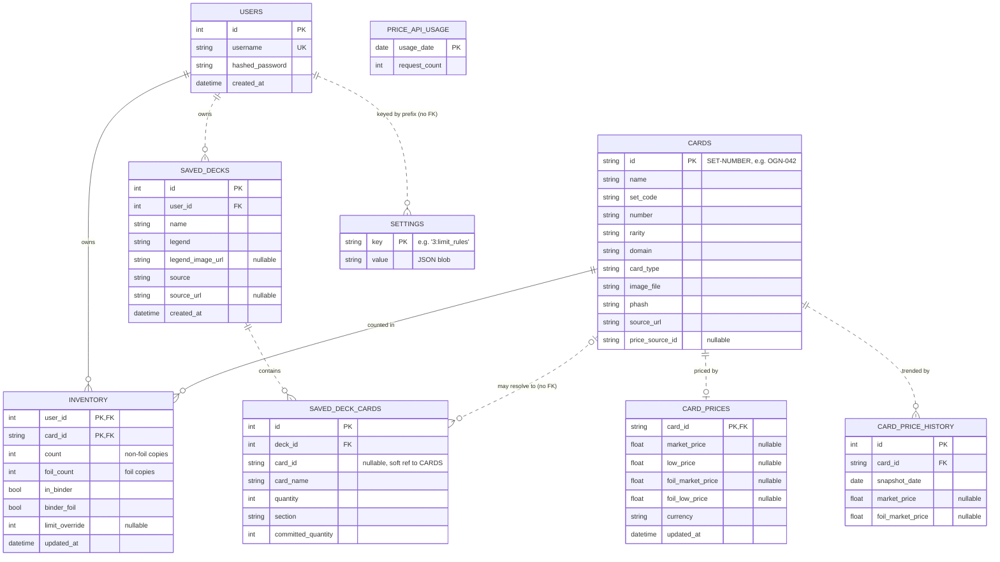

[← Docs index](README.md)

# 3. Data model

All tables are defined in **`backend/app/models.py`** using SQLAlchemy 2.0's typed
declarative style (`Mapped[...]` / `mapped_column(...)`).

---

## 3.1 Entity relationships

Solid lines (`──`) are **identifying** relationships — the child's own primary key
contains the parent's key, so the child cannot exist independently. Dashed lines (`┄┄`)
are **non-identifying**: the child has its own surrogate `id` and merely references the
parent. Two of the dashed links are *soft* references with no `FOREIGN KEY` constraint in
SQLite; they're labelled below and explained after the diagram.



**Reading the relationships:**

| Relationship | Cardinality | Notes |
|---|---|---|
| `USERS → INVENTORY` | one → zero-or-many | Identifying: `user_id` is half the composite PK |
| `CARDS → INVENTORY` | one → zero-or-many | Identifying: `card_id` is the other half |
| `CARDS → CARD_PRICES` | one → zero-or-**one** | `card_id` is the PK, and `Card.price` is `uselist=False` |
| `USERS → SAVED_DECKS` | one → zero-or-many | `SavedDeck.id` is a surrogate PK, so non-identifying |
| `SAVED_DECKS → SAVED_DECK_CARDS` | one → zero-or-many | Cascades: `cascade="all, delete-orphan"` |
| `CARDS → SAVED_DECK_CARDS` | zero-or-one → zero-or-many | **Not** a FK — see below |
| `USERS → SETTINGS` | one → zero-or-many | **Not** a FK — see below |

**Two deliberate non-FK links.** They look like modelling mistakes and aren't:

- **`SAVED_DECK_CARDS.card_id`** is a plain nullable `String(64)`, *not* a
  `ForeignKey("cards.id")`. An imported decklist is a list of card *names*; resolution to
  catalog ids happens in `routes/decks/_common.py` and is allowed to fail. A real FK would
  reject the whole import when one line names a card you haven't ingested yet, so the
  deck keeps `card_name` and leaves `card_id` null. `card_name` is therefore the
  authoritative column and `card_id` is the optimisation.
- **`SETTINGS.key`** encodes its owner in the string — `f"{user_id}:{SETTINGS_KEY}"`
  (`limits.py:43`) and `f"{current_user.id}:deck_options"` (`routes/settings.py:40`).
  There is no `user_id` column, so the database cannot enforce or cascade this. See
  [§3.2](#32-the-per-user-scoping-invariant) for the trade-off.

**`PRICE_API_USAGE` connects to nothing**, by design — it is a global daily counter for
the shared pricing quota, not per-user and not per-card.

---

## 3.2 The per-user scoping invariant

**This is the single most important thing to internalise.**

`InventoryItem`'s primary key is the *composite* `(user_id, card_id)`:

```python
class InventoryItem(Base):
    __tablename__ = "inventory"
    user_id: Mapped[int] = mapped_column(ForeignKey("users.id"), primary_key=True)
    card_id: Mapped[str] = mapped_column(ForeignKey("cards.id"), primary_key=True)
```

Everything follows from that:

- Look a row up with `db.get(InventoryItem, (user_id, card_id))` — the tuple is the key.
- **Every read of user data filters on `current_user.id`.** Every write targets it.
- The *only* place a user id comes from anywhere but the token is
  `GET /api/community/users/{user_id}/cards`, and that route is read-only by
  construction — it calls the same `build_card_list()` helper as `/api/cards` with a
  different user id, and there is no write counterpart anywhere in the codebase.

`SavedDeck` carries a `user_id` column and every deck route filters on it. Per-user
settings are namespaced by key prefix rather than a column: `f"{user_id}:limit_rules"`.

Shared, non-user data — `cards`, `card_prices`, `card_price_history`, `price_api_usage` —
is global on purpose. The catalog and market prices are facts about the game, not about
a person.

### Reviewing your own code

Before opening a PR that touches user data, ask:

1. Does every `db.query(InventoryItem | SavedDeck | Setting)` filter by user?
2. Does any user id reach the DB from a request body or path parameter?
3. If yes to (2), is the endpoint provably read-only?

---

## 3.3 Card ids

Card ids are `SET-NUMBER` slugs: `OGN-042`, `UNL-003`, `VEN-021`. Tokens carry a `-T<n>`
suffix (`UNL-T01`).

They are validated at ingest against `^[A-Za-z0-9_-]+$`, which makes them safe to embed
in filenames and URLs without escaping. The validation lives at the ingest boundary
(`ingest/fetch_official.py`), so by the time an id is in the database it is already
trusted.

Sorting is handled in `routes/cards.py`:

- `_number_key()` sorts collector numbers **numerically** — `number` is a string column,
  so a naive sort would put `"10"` before `"2"`.
- `_token_number()` detects tokens; `sort_cards()` pushes them to the back of each set,
  and `build_card_list()` rewrites their displayed `number` to `T01`-style labels.

---

## 3.4 Counts, finishes, and the binder

Four fields on `InventoryItem` describe "how much of this card do I have", and they mean
different things:

| Field | Meaning | Counts as *owned*? | Counts toward *playset*? |
|---|---|---|---|
| `count` | Non-foil physical copies | ✅ | ✅ |
| `foil_count` | Foil physical copies | ✅ | ✅ |
| `in_binder` | A copy is displayed in your binder | ✅ | ❌ |
| `binder_foil` | That binder copy is a foil | ✅ | ❌ |

**Why `count` and `foil_count` are independent tallies, not one number:** foils and
non-foils are different physical objects with different market prices, and a trade
request for "2 copies" is ambiguous about which. Keeping them separate makes every
downstream question answerable — which is why the trade basket, the preview table, and
the fulfil deduction are all per-finish.

**Why the binder is excluded from playset math:** a card sleeved in a display binder is
not available to put in a deck. Including it would tell you a playset is complete when
you can't actually build the deck. But you *do* own it, so it counts for "what am I
missing" views. This split is implemented in `frontend/src/lib/collection.ts`:
`isCollected()` includes the binder, `dashboardStats().playsetsComplete` does not.

**The coupling invariant:** `binder_foil` implies `in_binder`. Enforced server-side in
`routes/inventory.py` — setting `binder_foil` sets `in_binder`, and clearing `in_binder`
clears `binder_foil`. The Excel importer enforces the same rule. Because the backend
owns this, the frontend can send a single-field PATCH and trust the response.

**Foil-only rarities:** Rare and above are printed only as foils, so
`lib/collection.ts:isFoilOnly()` hides the non-foil counter for those cards. `Showcase`
rarity is a variant printing and is excluded from base-set completion percentages
(`isShowcase()`).

**Where `Showcase` comes from:** it is not a rarity Riot always publishes. Through
Spirit Forged the gallery tagged alt-art and overnumbered prints with rarity id
`showcase`; from **Vendetta (VEN)** on it reports the print's *underlying* rarity
(`rare`/`epic`) instead, which left VEN with zero Showcase cards. So
`ingest/fetch_official.py::is_showcase()` derives the category from the card's public
code instead, and falls back to the rarity field:

| Marker in the public code | Meaning | Example |
| --- | --- | --- |
| letter suffix | alt art of a base card | `VEN-021a/166` |
| `*` suffix | signed print | `VEN-189*/166` |
| number > the set-size denominator | "overnumber" | `VEN-167/166` |
| `SP<n>` | special-alt subset | `VEN-SP3/006` (Crystal Rose) |
| no denominator at all | token or rune — *not* showcase | `VEN-R01`, `UNL-T01` |

The rule reproduces the source-tagged counts for OGN (54), UNL (61), SFD (66) and OGS
(0) exactly, and yields 55 for VEN: 22 Rival Overnumbers (167–188), 9 Legend
Overnumbers (189–197), 18 alt arts (`###a`) and 6 Crystal Rose alts (SP1–SP6).

The ingest is insert-only, so cards already stored keep their old rarity. Re-derive
them with the one-off backfill:

```powershell
.venv\Scripts\python -m app.ingest.backfill_showcase --set VEN --dry-run
.venv\Scripts\python -m app.ingest.backfill_showcase --set VEN
```

---

## 3.5 Migrations

`backend/app/main.py::_migrate()` runs on **every** startup, before anything else
touches the DB:

```python
with engine.begin() as conn:
    cols = {row[1] for row in conn.execute(text("PRAGMA table_info(inventory)"))}
    if "foil_count" not in cols:
        conn.execute(text(
            "ALTER TABLE inventory ADD COLUMN foil_count INTEGER NOT NULL DEFAULT 0"
        ))
```

**To add a column:**

1. Add the `mapped_column(...)` to the model, with a `default=` **and** a
   `server_default=` if it's `NOT NULL`. New databases get it from `create_all()`.
2. Add a guarded `ALTER TABLE` in `_migrate()`. Existing databases get it from there.
3. If it belongs in an API response, add it to the Pydantic schema too — otherwise
   FastAPI strips it.

**Rules:**

- **Additive only.** Never drop, rename, or retype a column. SQLite's `ALTER TABLE`
  support is limited and a destructive change on a user's only copy of their data has no
  undo.
- **Idempotent.** The `PRAGMA table_info` guard means startup is safe to repeat.
- **Nullable or defaulted.** Existing rows must get a sensible value with no backfill
  step.
- If you genuinely need a destructive change, that's an Alembic conversation — raise it
  in the PR, don't improvise.

Note the guard style in the `saved_deck_cards` block: `if sdc_cols and ...` — it skips
the migration entirely when the table doesn't exist yet, so a fresh database doesn't try
to alter a table `create_all()` is about to make.

---

## 3.6 Session and transaction handling

`backend/app/db.py`:

```python
create_engine(f"sqlite:///{db_path}", connect_args={"check_same_thread": False})
sessionmaker(bind=engine, autoflush=False, expire_on_commit=False)
```

- **`check_same_thread=False`** — FastAPI may serve a request on a different thread than
  the one that opened the connection. SQLAlchemy's pool still serializes access per
  session, so this is safe here.
- **`expire_on_commit=False`** — after `db.commit()`, ORM objects stay usable without a
  refetch. That's why routes can `db.commit()` and then immediately build a response
  from the same object.
- **`autoflush=False`** — no surprise flushes mid-query. Note the consequence in
  `pricing/budget.py::spend()`: it flushes *explicitly* so a second `spend()` in the same
  transaction finds the row via `db.get()` instead of inserting a duplicate.

Sessions are request-scoped via the `get_db` dependency in `deps.py`, which yields a
session and closes it in a `finally`. **Routes are responsible for committing.**

---

Next: [Authentication →](04-authentication.md)
