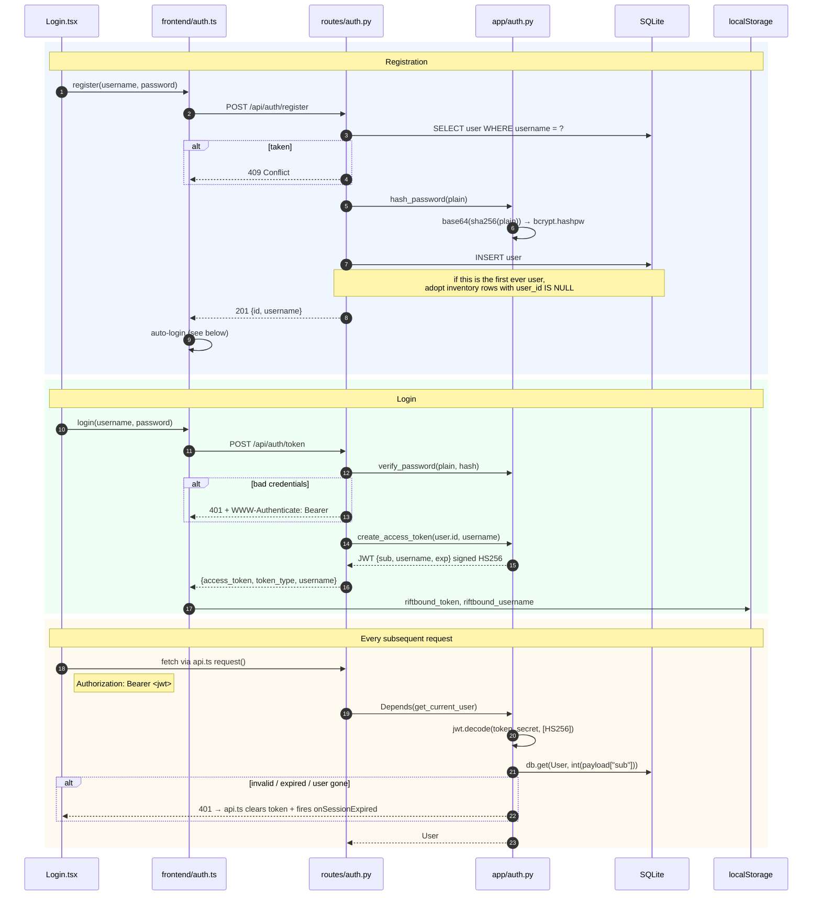

[← Docs index](README.md)

# 4. Authentication

**Model:** username + password → a signed JWT → `Authorization: Bearer` on every request.
No sessions, no cookies, no server-side token store.

**Code:** `backend/app/auth.py` · `backend/app/routes/auth.py` ·
`frontend/src/auth.ts` · `frontend/src/api.ts` · `frontend/src/screens/Login.tsx`

---

## 4.1 The full flow



---

## 4.2 Password hashing

`backend/app/auth.py`:

```python
def _prehash(plain: str) -> bytes:
    """SHA-256 pre-hash so bcrypt always receives ≤44 bytes regardless of
    password length (bcrypt truncates at 72 bytes, which would make passwords
    that differ only beyond that point hash identically)."""
    return base64.b64encode(hashlib.sha256(plain.encode()).digest())

def hash_password(plain: str) -> str:
    return bcrypt.hashpw(_prehash(plain), bcrypt.gensalt()).decode()
```

**Why bcrypt.** It is a deliberately slow, salted, adaptive hash. `gensalt()` generates a
fresh random salt per password (embedded in the output string), so identical passwords
produce different hashes and rainbow tables are useless. The work factor can be raised as
hardware gets faster without changing the stored format.

**Why the SHA-256 pre-hash.** bcrypt silently truncates its input at 72 bytes. Without a
pre-hash, two long passphrases sharing a 72-byte prefix would hash identically — a real
weakness for users who use long passphrases (exactly the users doing the right thing).
Hashing to a fixed 32 bytes first, then base64-ing to 44 ASCII bytes, sidesteps the limit
entirely. The base64 step matters too: it removes any NUL bytes, which some bcrypt
implementations treat as string terminators.

> - [OWASP: Password Storage Cheat Sheet](https://cheatsheetseries.owasp.org/cheatsheets/Password_Storage_Cheat_Sheet.html) — recommends exactly this pre-hash pattern
> - [Wikipedia: bcrypt § Maximum password length](https://en.wikipedia.org/wiki/Bcrypt#Maximum_password_length)

**Verification** uses `bcrypt.checkpw`, which is constant-time with respect to the hash
comparison. The login route returns the same 401 for "no such user" and "wrong password",
so the response doesn't confirm whether a username exists.

---

## 4.3 The token

```python
jwt.encode(
    {"sub": str(user_id), "username": username, "exp": expire},
    jwt_secret(),
    algorithm="HS256",
)
```

| Claim | Value | Used for |
|---|---|---|
| `sub` | user id as a string | `db.get(User, int(sub))` — the authoritative identity |
| `username` | display name | convenience only; **never** trusted for authorization |
| `exp` | now + `TOKEN_EXPIRE_DAYS` (default 30) | verified by `jwt.decode`, which raises on expiry |

**HS256 (symmetric).** One secret both signs and verifies. Appropriate because a single
service does both. If you ever split issuing from verifying, move to RS256 so verifiers
only need the public key.

**The secret** comes from `config.jwt_secret()`: `RIFTBOUND_JWT_SECRET` if set, otherwise
a `secrets.token_hex(32)` generated once and persisted to `data/secret.key`. The
persistence matters — a per-process random secret would log everyone out on every
restart.

⚠️ **In Docker, `data/` is bind-mounted, so `secret.key` survives rebuilds.** If you
change `RIFTBOUND_DATA_DIR` or wipe `data/`, every existing token becomes invalid and
all users are logged out. That is also your emergency revocation lever: delete
`secret.key` (or rotate `RIFTBOUND_JWT_SECRET`) to invalidate every token at once.

---

## 4.4 Protecting a route

Auth is a **dependency**, not middleware:

```python
from ..auth import get_current_user
from ..models import User

@router.get("/thing")
def read_thing(
    db: Session = Depends(get_db),
    current_user: User = Depends(get_current_user),   # ← this line is the auth
):
    return db.query(Thing).filter(Thing.user_id == current_user.id).all()
```

`get_current_user` depends on `OAuth2PasswordBearer(tokenUrl="/api/auth/token")`, which
extracts the token from the `Authorization` header and returns **401** if it's missing or
malformed. `get_current_user` then decodes, verifies the signature and expiry, loads the
`User`, and raises 401 with `WWW-Authenticate: Bearer` if any step fails.

Routes that need auth but not the user object use `_: User = Depends(get_current_user)`
— the underscore is the convention here (see `routes/prices.py`).

**Every route in the app depends on it except the two in `/api/auth/`.** If you add a
router, adding this dependency is not optional. There is no global default that would
catch the omission for you.

> - [FastAPI: OAuth2 with Password (and hashing), Bearer with JWT](https://fastapi.tiangolo.com/tutorial/security/oauth2-jwt/)
> - [RFC 6750: Bearer Token Usage](https://datatracker.ietf.org/doc/html/rfc6750)
> - [RFC 7519: JSON Web Token](https://datatracker.ietf.org/doc/html/rfc7519)

---

## 4.5 The frontend side

**`src/auth.ts`** owns token storage and the two *unauthenticated* calls:

```ts
getToken()  getUsername()  setToken(token, username)  clearToken()
login(username, password)   // stores the token as a side effect
register(username, password)
```

`login()` and `register()` use their own bare `fetch` — they can't go through the
authenticated wrapper, since there's no token yet. They surface the backend's `detail`
string as the error message, which is why the login form shows "Username already taken"
rather than "Request failed: 409".

**`src/api.ts`** owns every *authenticated* call through one wrapper:

```ts
async function request<T>(url: string, init?: RequestInit): Promise<T> {
  const token = getToken();
  const authHeader = token ? { Authorization: `Bearer ${token}` } : {};
  const resp = await fetch(url, { ...init, headers: { ...(init?.headers ?? {}), ...authHeader } });
  if (resp.status === 401) {
    // Only bounce if we actually presented a token — a 401 on an already
    // unauthenticated call means nothing expired.
    if (token) {
      clearToken();
      onSessionExpired();       // → App.handleLogout() → Login screen
    }
    throw new Error("Session expired");
  }
  if (!resp.ok) throw new Error(`${init?.method ?? "GET"} ${url} failed: ${resp.status}`);
  return resp.json() as Promise<T>;
}
```

The 401 handler is the whole session-expiry story: clear the token, hand off to the
callback `App` registered via `setSessionExpiredHandler`, and `App.tsx` renders `Login`
because `username` is now null. There's no refresh-token dance.

> **This used to be `location.reload()`.** Two problems: it threw away the entire
> document — current screen, every filter, and any inventory edit still inside its 600 ms
> debounce — and it fired on *any* 401, including one from a call that never presented a
> token. Re-rendering in place instead means sessionStorage view state survives, so after
> logging back in you land where you left off. If you add another auth failure path, hand
> it to the same handler rather than reaching for a reload.

> **Always add new API calls through `request()`.** A call that uses bare `fetch` gets no
> auth header and no 401 handling. This has already happened once —
> [known issue #1](09-known-issues.md).

**`App.tsx`** is the gate:

```tsx
const [username, setUsername] = useState<string | null>(() =>
  getToken() ? getUsername() : null,
);
if (!username) return <Login onLogin={handleLogin} />;
```

Logging out calls `clearToken()`, drops all cached state (`cards`, `savedDecks`), and
calls `clearPersistedView()` to wipe the `riftbound.view.*` sessionStorage namespace — so
neither collection data nor the previous account's filters and drill-downs can leak into
the next session. Anything new you persist must live under that prefix for the same reason.

---

## 4.6 Where the token is stored, and why that's a trade-off

The JWT lives in `localStorage`.

**Pro:** trivial to attach as a header, immune to CSRF (an attacker's site can't read
your `localStorage`, and no credential rides along automatically with a cross-site
request), survives tab close, works identically in dev and prod.

**Con:** readable by any JavaScript running on the page, so a successful XSS steals the
token. The alternative — an `HttpOnly; Secure; SameSite=Strict` cookie — is not readable
by JS but reintroduces CSRF, which then needs its own token.

For a self-hosted, same-origin app with no third-party scripts and no user-generated HTML,
`localStorage` is a reasonable call. **If this ever becomes internet-facing, revisit it**
alongside rate limiting and token revocation.

> - [OWASP: HTML5 Security Cheat Sheet § Local Storage](https://cheatsheetseries.owasp.org/cheatsheets/HTML5_Security_Cheat_Sheet.html#local-storage)
> - [OWASP: JWT for Java Cheat Sheet](https://cheatsheetseries.owasp.org/cheatsheets/JSON_Web_Token_for_Java_Cheat_Sheet.html) — storage and revocation trade-offs, language-agnostic

---

## 4.7 Auth in tests

`backend/conftest.py` gives you a client that's already logged in:

```python
@pytest.fixture()
def client(tmp_path, monkeypatch):
    monkeypatch.setenv("RIFTBOUND_DATA_DIR", str(tmp_path))
    monkeypatch.setenv("RIFTBOUND_SEED", "1")
    c = TestClient(create_app())
    c.post("/api/auth/register", json={"username": "testuser", "password": "testpass1"})
    resp = c.post("/api/auth/token", json={"username": "testuser", "password": "testpass1"})
    c.headers.update({"Authorization": f"Bearer {resp.json()['access_token']}"})
    return c
```

Fresh temp database per test, seeded, with `testuser` authenticated.

- **A second user:** register + log in again and pass an explicit header. See the
  `_register()` helper in `tests/test_community.py` and `tests/test_trades.py`.
- **Testing the unauthenticated path:** `client.headers.pop("Authorization")`, then assert
  401. Every new protected endpoint should have one of these.

---

Next: [API reference →](05-api-reference.md)
