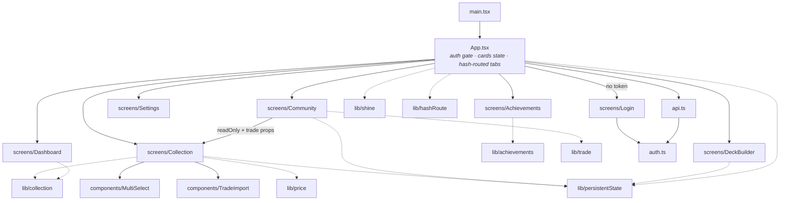

[← Docs index](README.md)

# 6. Frontend guide

React 18 + TypeScript + Vite. No router library, no state library, no CSS framework, no
component library. **Two runtime dependencies: `react` and `react-dom`.** That is
intentional — see [design choices](#63-design-choices-and-why) below. Routing is ~30 lines
of hash handling in `lib/hashRoute.ts`.

---

## 6.1 Component map



The reuse worth noticing: **`Community` renders `Collection`** with `readOnly` and
`trade` props. One grid implementation serves both your own editable collection and
someone else's read-only one, so a change to card tiles lands in both places at once.

---

## 6.2 State ownership

There is one rule: **`App.tsx` owns anything two screens need; everything else is local.**

| State | Owner | Why there |
|---|---|---|
| `username` / auth gate | `App` | Decides whether to render `Login` at all |
| Active tab | `location.hash` ↔ `App` | Must survive a reload; see [durable view state](#durable-view-state) |
| `cards: Card[]` | `App` | Dashboard, Collection, Achievements and DeckBuilder all read it |
| `savedDecks` → `commitmentMap` | `App` | Owned by DeckBuilder, read by Collection |
| `preset` (dashboard → collection deep-link) | `App` | Crosses a tab boundary |
| Filters, search, selected deck, viewed user | Each screen, via `usePersistedState` | Nobody else cares, but losing them on reload is infuriating |
| Zoom lightbox, import wizards | Each screen, plain `useState` | Deliberately volatile — a modal that reopens itself is disorienting |
| Trade basket | `Community` | Scoped to one viewed collection; cleared on navigation |
| Foil-shine prefs | `localStorage` + `:root` CSS vars | A rendering preference, not collection data |

### Durable view state

Three storage tiers, and picking the wrong one is the mistake to avoid:

| Tier | Holds | Lifetime |
|---|---|---|
| `localStorage` (`auth.ts`, `shine.ts`) | JWT, username, shine prefs | Until logout — follows you into new tabs |
| `location.hash` (`lib/hashRoute.ts`) | The active tab | The URL — shareable, bookmarkable, back-button-navigable |
| `sessionStorage` (`lib/persistentState.ts`) | Filters, selected deck, viewed community user | This browser tab, across reloads; a fresh tab starts clean |

**Why any of this exists:** mobile browsers discard backgrounded tabs to reclaim memory,
and returning to one re-runs the document as a *fresh page load*. The token survived that
(localStorage) but nothing else did, so a phone that slept for five minutes came back
logged in on the Overview tab with every filter reset. A reload and a tab discard are the
same event to the app — which is why pressing F5 is a faithful reproduction.

```tsx
// usePersistedState is useState with a sessionStorage mirror. A null key opts
// out, which is how one component serves several independent instances.
const slot = (name: string) => (persistKey ? `collection.${persistKey}.${name}` : null);
const [rarityFilter, setRarityFilter] = usePersistedState<string[]>(slot("rarity"), []);
```

Three rules when you add a persisted slot:

1. **Namespace anything on a reused screen.** `Collection` renders three ways (your shelf,
   someone else's, trade mode); without `persistKey` they'd share one bucket and browsing
   a friend's collection would inherit your filters.
2. **Persist ids, not objects.** `Community` stores the selected user's *id* and resolves
   it against a freshly fetched directory, so a renamed or deleted user can't be restored
   stale. Consumers of a restored id must already tolerate it not resolving — `DeckBuilder`
   falls through to `null` and renders the deck list.
3. **Don't persist unsaved input or modals.** Import wizards and the zoom lightbox stay
   volatile on purpose.

Everything under the `riftbound.view.` prefix is dropped by `clearPersistedView()` on
logout, so one account's drill-downs never greet the next login.

### The in-place patch pattern

`App` passes `updateCard` down:

```tsx
const updateCard = useCallback((card: Card) => {
  setCards(prev => prev.map(c => (c.id === card.id ? card : c)));
}, []);
```

Every mutating endpoint returns the updated `CardOut`, so a `+` click replaces one array
element. **No refetch of 950 cards after every click.** This is why the backend convention
"mutations return the updated resource" exists — the two halves are designed together.

### Optimistic updates + debounce

`Collection.tsx` is the one place with real interaction complexity. Clicking `+`:

1. Computes the new count from the **pending** value if one is in flight, so fast clicking
   stacks correctly rather than racing on stale props.
2. Calls `emit()` immediately — the UI updates with zero network latency.
3. Debounces a `PATCH` by 600 ms, keyed `` `${card.id}:${finish}` `` so normal and foil are
   independent timers.
4. On network failure, `emit(card)` reverts to the pre-click card and logs.

**Pending edits are flushed, never dropped.** Everything a save needs lives in the
`PendingEdit` record rather than in the timer's closure, so `flush(key)` can fire an edit
early from outside — on unmount, on `visibilitychange`, and on `pagehide`:

```ts
interface PendingEdit {
  card: Card;   // pre-click card, for reverting on a failed save
  foil: boolean;
  count: number;
  timer: ReturnType<typeof setTimeout>;
}
```

The lifecycle flush passes `keepalive: true` through to `patchInventory`, so the request
outlives the page being frozen — a plain `fetch` would be cancelled, and `sendBeacon`
can't carry the `Authorization` header. `visibilitychange` is the signal that actually
fires on iOS; `beforeunload` does not.

This matters because the 600 ms window is exactly when a phone gets backgrounded. The
cleanup used to only `clearTimeout` the pending timers, which silently discarded the
click — losing real data, not just navigation state. Switching tabs inside the app hit the
same bug. If you add another rapid-fire control, reuse this shape rather than inventing a
second one.

> - [React: Queueing a series of state updates](https://react.dev/learn/queueing-a-series-of-state-updates)
> - [Kent C. Dodds: Optimistic UI](https://kentcdodds.com/blog/optimistic-ui) — the pattern and its failure mode
> - [MDN: Page Visibility API](https://developer.mozilla.org/en-US/docs/Web/API/Page_Visibility_API) — why `visibilitychange`, not `beforeunload`
> - [MDN: fetch keepalive](https://developer.mozilla.org/en-US/docs/Web/API/RequestInit#keepalive)

---

## 6.3 Design choices and why

### No state management library

`cards` is one array; everything else is a boolean or a filter string. `useState` in `App`
plus a patch callback covers it. Redux/Zustand/React Query would add a dependency,
a mental model, and a devtools setup to solve a problem this app doesn't have.

**When you'd reconsider:** if a third screen needed to *write* `cards`, or if the app grew
server-state concerns (background refetch, cache invalidation, request dedup) that
`useEffect` handles badly. Today `App` fetches once per login and patches in place.

> - [React: Sharing state between components](https://react.dev/learn/sharing-state-between-components) — lifting state, which is exactly what `App` does
> - [React: You Might Not Need an Effect](https://react.dev/learn/you-might-not-need-an-effect) — why derived values like `commitmentMap` are `useMemo`, not state

### Hash routing, not a router library

The tab lives in `location.hash` (`/#/collection`) and screens are still picked by
conditional rendering. `lib/hashRoute.ts` is the whole implementation — a `Tab` union, a
`TABS` array, and two pure functions:

```ts
readTabFromHash("#/collection")  // → "collection"; null for anything unknown
tabToHash("collection")          // → "#/collection"
```

`App.tsx` wires it in three places: a lazy initializer
(`readTabFromHash(location.hash) ?? DEFAULT_TAB`), an effect pushing `tab` → hash, and a
`hashchange` listener pulling hash → `tab`. The effect compares before writing, so the two
directions can't loop. The first render normalises a bare `/` with `history.replaceState`
so there's no empty entry to step back through; ordinary tab clicks *assign*
`location.hash` and do push — which is what makes the device back button move between tabs
instead of leaving the app.

**Why not `useState<Tab>`, which is what this was?** A hardcoded initial value meant every
document reload landed on Overview — including the reload a phone performs after
discarding a backgrounded tab. See [durable view state](#durable-view-state).

**Why not `react-router`?** Six top-level views and no nested or parameterised routes. The
hash form needs no dependency and no server config: the fragment never leaves the browser,
so Vite's dev server and the prod `try_files … /index.html` fallback both already work
unchanged. **When you'd reconsider:** deep links *into* a screen — a specific community
collection or a saved deck — where you'd want real path params and nested routes rather
than growing an ad-hoc parser. The `Tab` union and `TABS` array are the seam to map onto.

### All API calls in one typed module

`api.ts` exports one function per endpoint, each with an explicit return type from
`types.ts`. Benefits: one place to change when a route changes, one place where auth is
attached, one place where 401 is handled, and TypeScript catches shape mismatches at build
time.

**`types.ts` mirrors the backend's `schemas.py` by hand.** There is no code generation.
When you change a Pydantic model, update the TS interface in the same PR — nothing will
warn you.

> If a call needs auth, it goes through `request()`. A bare `fetch` gets no header and no
> 401 handling. See [known issue #1](09-known-issues.md) for what that looks like in
> production.

### Pure logic lives in `lib/`

| Module | Responsibility |
|---|---|
| `collection.ts` | `completionStatus`, `progressPct`, `dashboardStats`, `setBreakdown`, `isCollected`, `isFoilOnly`, `isShowcase`, `compareRarity` |
| `achievements.ts` | Achievement definitions + tier computation (bronze/silver/gold/prismatic) |
| `trade.ts` | Basket state: `setSelection` (clamped to what the owner holds), `selectionCount`, `selectionToItems` |
| `price.ts` | Price/percentage formatting |
| `shine.ts` | Foil-shine settings ↔ CSS custom properties, with `sanitizeShineSettings` clamping |
| `hashRoute.ts` | The `Tab` union, `TABS`, `TAB_LABELS`, and `readTabFromHash` / `tabToHash` |
| `persistentState.ts` | `usePersistedState` + `readPersisted` / `writePersisted` / `clearPersistedView` |

Every one has a `.test.ts` beside it. Vitest runs in a **node** environment (see
`vite.config.ts`) — no jsdom, no React Testing Library. That's the deal: keep logic pure
and it's trivially testable; put it in a component and it isn't tested at all.

`persistentState.ts` is the one module that isn't purely pure: `usePersistedState` is a
hook and goes untested, but the `readPersisted` / `writePersisted` / `clearPersistedView`
helpers underneath it carry all the logic worth testing and are covered. Because the test
env is `node`, `persistentState.test.ts` stubs `sessionStorage` via `vi.stubGlobal` — copy
that helper if you need storage in another test. Splitting a hook this way, so the decisions
sit in plain functions and the hook is a thin wrapper, is the pattern to follow.

This is the highest-leverage convention in the frontend. When a screen starts growing
conditionals, extract the decision into `lib/` and test it there.

### Hand-written CSS with custom properties

`styles.css` is a single ~1,850-line stylesheet, organised into commented sections
(`/* ── Card Grid ── */`). The palette and glow colours are CSS custom properties on
`:root`:

```css
:root {
  --bg: #080810;  --panel: #0f0f1c;  --text: #e0deff;  --muted: #6060a0;
  --accent: #c8aa6e;  --green: #00ff88;  --amber: #ffcc00;  --red: #ff3355;
  --border: #1e1e38;  --glow-accent: rgba(200, 170, 110, 0.4);
}
```

The retro pixel-art theme (`Press Start 2P`, hard borders, glow shadows) is the product,
not decoration. Tailwind or MUI would be fought at every step.

`lib/shine.ts` shows the technique worth learning here: it writes CSS variables onto
`document.documentElement` **and** injects a generated `@keyframes` rule, because keyframe
*percentages* can't be variables. That lets sweep speed vary independently of cycle
duration without re-rendering React.

> - [MDN: Using CSS custom properties](https://developer.mozilla.org/en-US/docs/Web/CSS/Using_CSS_custom_properties)
> - [MDN: prefers-reduced-motion](https://developer.mozilla.org/en-US/docs/Web/CSS/@media/prefers-reduced-motion) — honoured for the shine animation

---

## 6.4 CSS conventions you must know

### Grids are auto-fill, never fixed columns

```css
.grid { grid-template-columns: repeat(auto-fill, minmax(170px, 1fr)); }
```

Column count follows the viewport with no breakpoint per width. Breakpoints exist only at
900px (trade basket stacks above the grid via `order: -1`) and 600px (touch-sized
controls).

### `.card-tile` clips — rows must wrap, not overflow

`.card-tile` has `overflow: hidden`. Anything inside it that can run out of width **must**
degrade by wrapping:

```css
.card-row { display: flex; align-items: center; flex-wrap: wrap; gap: 4px 6px; }
.count    { flex: 0 0 auto; min-width: 52px; }   /* never squeezed below its text */

/* The trade stepper always takes its own line: label + count + stepper cannot
   share one line at the grid's 150–170px column width, and forcing the break
   keeps every row identical instead of some wrapping as tile width drifts. */
.trade-stepper { display: flex; justify-content: flex-end; flex: 0 0 100%; gap: 3px; }
```

`.count-label` deliberately has **no** `min-width: 0` — that's what makes the row wrap
instead of truncating "NORMAL" to "NORM…". This was a real bug; don't undo it.

> **Watch the font.** `Press Start 2P` is roughly **1em per glyph** — far wider than any
> fallback monospace. If you measure layout before webfonts load, every number is ~40%
> too small and your conclusion is wrong. Gate any measurement on `document.fonts.ready`.

### Specificity in the mobile block

`@media (max-width: 600px)` sits *above* some base `.card-row button` rules in source
order, so a plain `.trade-stepper button` there loses. Match the existing selector depth:

```css
@media (max-width: 600px) {
  .card-row .trade-stepper button { min-width: 30px; height: 30px; }  /* 0,2,1 wins */
}
```

---

## 6.5 Screen notes

**`Login.tsx`** — Login/register toggle in one component. Client-side checks (≥6 chars,
passwords match) mirror the server's; the server is still authoritative. Registration
auto-logs-in.

**`Dashboard.tsx`** — Pure render over `lib/collection.dashboardStats` and
`setBreakdown`. "View missing" sets a `preset` on `App` and switches tabs.

**`Collection.tsx`** (~400 lines, the biggest screen) — Filters, the grid, count controls,
binder toggles, the zoom lightbox, and the trade-import entry point. Its two extension
props:

```tsx
readOnly?: boolean;   // someone else's collection: no +/-, plain-text counts,
                      // disabled checkboxes, no limit-override prompt
trade?: {             // request mode: per-finish steppers capped at what they hold
  selection: TradeSelectionMap;
  onChange: (card: Card, finish: Finish, quantity: number) => void;
};
persistKey?: string;  // namespace for remembering filters across a reload.
                      // "mine" from App, "community" from Community; omit to opt out
```

`onCardChange` is optional; every mutation path goes through
`const emit = (card: Card) => onCardChange?.(card)`, so with no handler wired there is no
code path that can PATCH. Read-only is enforced by construction, not by a disabled
attribute.

**`Community.tsx`** — Directory grid → selected user's collection. Owns the trade basket
and clears it whenever a different user is opened or you navigate back (a basket belongs
to exactly one collection). The collection fetch uses an `active` flag in its cleanup so a
slow response for a user you've already navigated away from is discarded.

The drill-down survives a reload: `selectedId` is persisted and resolved against the
directory in the users-fetch effect, which then drives the existing collection fetch
unchanged. The basket is deliberately *not* persisted — restoring a half-built request
against counts that may have shifted is worse than starting over.

Note its root is `<div className="community">`, **not** `<main>` — it renders `Collection`,
which already returns a `<main>`, and nesting them is invalid HTML.

**`Settings.tsx`** — Limit rules, shine tuning, JSON + Excel backup.

**`DeckBuilder.tsx`** (~900 lines) — The largest file. Community deck browsing, decklist
import, saved decks, and committing copies to decks. If you're extending it, extract
logic into `lib/` as you go.

**`Achievements.tsx`** — Renders `lib/achievements.computeAchievements(cards)`. All
achievement state is derived from the card list; nothing is persisted server-side.

---

Next: [Feature deep dives →](07-feature-deep-dives.md)
