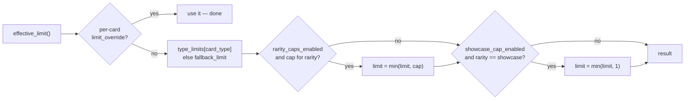
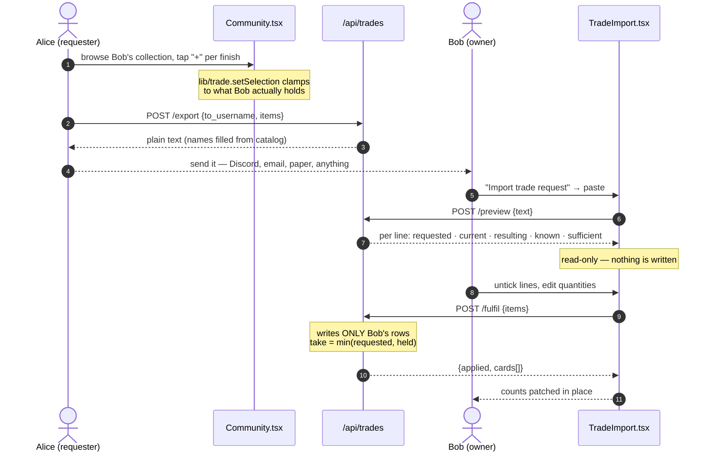
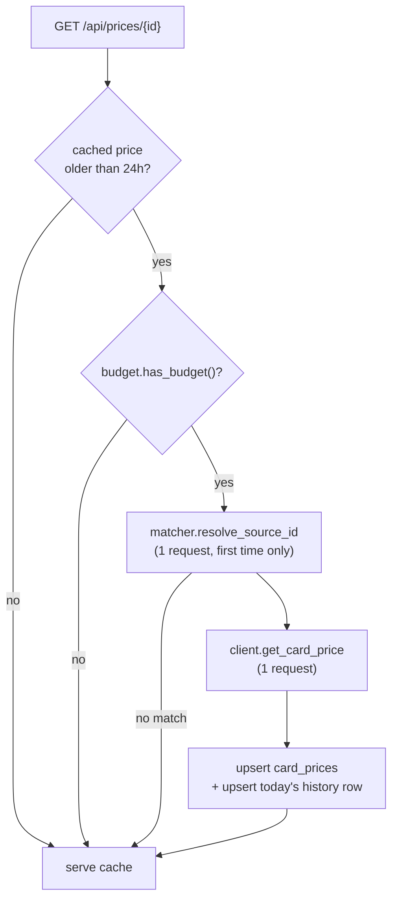

[← Docs index](README.md)

# 7. Feature deep dives

Read the section for whatever you're working on. Each one covers the domain rules, the
code path, and the decisions that aren't obvious from reading the code.

- [Collection limits](#collection-limits)
- [Trade requests](#trade-requests)
- [Community views](#community-views)
- [Card ingest](#card-ingest)
- [Market pricing](#market-pricing)
- [Decks](#decks)
- [Backup & Excel](#backup--excel)

---

## Collection limits

**Code:** `backend/app/limits.py` · surfaced through every `CardOut.limit`

### The domain rule

Riftbound's deck construction rules cap what a deck may contain: at most **3 copies** of
any card, exactly **1 Legend**, **3 distinct Battlefields** (1 copy each), and a
**12-card rune deck**. Owning that many copies means you can build *any* deck that uses
the card — which is the natural definition of "this card is complete" for a collector.

That's where `DEFAULT_RULES` comes from:

```python
"type_limits": { "unit": 3, "spell": 3, "gear": 3,
                 "legend": 1, "battlefield": 1, "rune": 12 }
```

> [Riftbound deckbuilding primer](https://playriftbound.com/en-us/news/rules-and-releases/deckbuilding-primer/) — the source of these numbers

### Resolution order

Most specific wins:



The caps use `min()`, never assignment — a cap can only ever *lower* a limit. Rarity caps
exist for collectors who keep one Epic for display rather than a playset for play.

### Storage and merge semantics

Rules are a JSON blob in `settings` keyed `"{user_id}:limit_rules"`. `get_rules()` deep-
copies `DEFAULT_RULES` and merges the stored blob over it:

```python
merged.update({k: stored[k] for k in stored if k in merged})
```

The `if k in merged` filter is the important part: **unknown keys in storage are ignored**.
That means a key removed from `DEFAULT_RULES` in a later version can't resurrect from an
old row. The cost is that a key must exist in `DEFAULT_RULES` *and* in the
`schemas.LimitRules` Pydantic model to survive a round-trip — miss the schema and the
value is silently dropped ([known issue #2](09-known-issues.md)).

**Adding a rule** = `DEFAULT_RULES` + `LimitRules` schema + `effective_limit()` logic +
`types.ts` + a Settings control + a test in `tests/test_limits.py`.

---

## Trade requests

**Code:** `backend/app/trades.py` (format) · `backend/app/routes/trades.py` (endpoints) ·
`frontend/src/lib/trade.ts` (basket) · `frontend/src/screens/Community.tsx` (requester) ·
`frontend/src/components/TradeImport.tsx` (owner)

### The flow



### The text format

```
# RIFTBOUND TRADE REQUEST v1
# From: alice
# To: bob
# Date: 2026-07-31

2x UNL-003 Mosstomper
1x UNL-003 Mosstomper [foil]
1x UNL-011 Baron Pit

# 4 copies requested
```

Design properties, in priority order:

1. **Human-readable.** It gets pasted into a chat window. A collector must be able to read
   it, sanity-check it, and edit it.
2. **Leniently parseable.** `2x UNL-003`, `2 UNL-003`, and the full line all parse. `#`
   lines are metadata or comments. Unreadable lines become **warnings**, never exceptions —
   `parse_request` cannot raise.
3. **The card id is authoritative;** the trailing name is for humans only. Ids are matched
   against the catalog; names are never used for lookup.
4. **Duplicate `(card_id, finish)` lines are summed**, so a hand-edited request with the
   same card twice behaves sensibly.
5. **Sorted output** by `(card_id, foil)`, so the same basket always exports identically.

### Why the writer and parser share a module

`format_request` and `parse_request` are both in `trades.py`. A round-trip test —
format, parse, compare — covers the entire contract, and any change to one side is
physically adjacent to the other. Split them and the format drifts; that is how every
serialization bug starts.

### Why per-finish, not per-card

Normal and foil are separate tallies in `InventoryItem`. A request for "2 copies" of a
card you hold as 1 normal + 3 foil is ambiguous about what changes hands — and the
deduction would have to guess. Every layer therefore carries `foil: bool`: the basket
(`TradeSelection {normal, foil}`), the wire format (`TradeItem`), the text (`[foil]`), the
preview row, and the fulfil deduction.

### Why there is no trade table

A trade is a real-world negotiation. Modelling it as a stateful entity would require
invitations, accept/decline/expire states, notifications, and a reconciliation story for
trades that happened in person — all to support a requirement that is actually just
"deduct these counts when the cards physically change hands."

Statelessness also removes a whole class of bugs: there is no stale record to
reconcile, no half-completed trade, and nothing to clean up.

### The safety argument

The preview is **advisory**. `POST /api/trades/fulfil` re-validates everything:

```python
inv = db.get(InventoryItem, (current_user.id, item.card_id))   # caller's row only
if inv is None:
    continue                                                    # hold nothing, give nothing
take = min(item.quantity, inv.count)                            # clamped to held
inv.count -= take
```

Therefore a stale, forged, or hand-edited request **cannot** drive a count negative and
**cannot** touch another user's rows. Both properties are covered by
`test_fulfil_clamps_to_what_is_actually_held` and `test_fulfil_only_ever_touches_the_caller`.
If you refactor this endpoint, those two tests are the contract.

`applied` is what was actually deducted, which may be less than requested — the UI reports
the real number.

### Frontend basket

`lib/trade.ts` is pure and fully unit-tested:

- `setSelection(map, cardId, finish, qty, owned)` — clamps to `0..owned`, returns a **new**
  Map (so React sees the change), and **deletes** entries that hit zero so the side list
  and tile highlight both fall away.
- `selectionCount(map)` — total copies.
- `selectionToItems(map)` — flattens to the wire format, ids sorted for stable exports.

`Community.tsx` clears the basket on every navigation: a basket belongs to exactly one
collection, and carrying it across users would let you request cards the new owner doesn't
have.

---

## Community views

**Code:** `backend/app/routes/community.py` · `frontend/src/screens/Community.tsx`

`GET /api/community/users` returns every user with a headline (`unique_cards`,
`total_copies`) computed in **one grouped query**, not per user — the directory stays cheap
as users are added. `is_self` lets the UI badge your own row.

`GET /api/community/users/{user_id}/cards` calls the *same* `sort_cards()` +
`build_card_list()` helpers as `/api/cards`, with a different user id. Identical payload
shape, identical ordering, resolved against that user's inventory **and their limit
rules** — so you see their collection as they see it.

**Read-only is structural, not cosmetic.** There is no write endpoint anywhere that
accepts a user id; every mutation targets `current_user`. On the frontend, `Collection`'s
`onCardChange` is optional and all mutation paths funnel through
`onCardChange?.(card)` — with no handler passed, no code path can PATCH.

---

## Card ingest

**Code:** `backend/app/ingest/`

| Module | Purpose |
|---|---|
| `fetch_official.py` | Primary source — scrapes Riot's card gallery |
| `fetch_scrydex.py` | Alternative source, needs an API key |
| `seed.py` | Generates demo cards on an empty DB |
| `pipeline.py` | Shared normalization/upsert helpers |
| `migrate_card_ids.py` | One-off id-scheme migration |

### Why Riot's own gallery

- **First-party and always current.** It's Riot's published data.
- **Explicitly permitted.** `playriftbound.com/robots.txt` is `Allow: /`. Marketplace
  sites (TCGPlayer etc.) forbid scraping in their ToS, so they are deliberately not used
  for catalog data.
- **Cheap.** The gallery page embeds its entire card database as JSON, so all metadata is
  *one* request; only images are per-card.

The fetcher sends a descriptive User-Agent, sleeps 250 ms between image downloads
(`--delay`), caches locally, and skips already-ingested cards on re-run — a new set
release is just another run.

### Image safety

Every downloaded image is:

1. Fetched over **HTTPS only** from an explicit **host allowlist**.
2. Checked for Content-Type and a 10 MB size cap.
3. **Re-encoded through Pillow** before storage — the stored JPEG contains pixels only,
   which strips metadata and anything smuggled in a container field.
4. Saved under a filename derived from the validated card id (`^[A-Za-z0-9_-]+$`), never
   from the remote URL.

SVG is never accepted, because it can carry scripts.

> [OWASP: File Upload Cheat Sheet](https://cheatsheetseries.owasp.org/cheatsheets/File_Upload_Cheat_Sheet.html)

### Seeding

On an empty DB, `create_app()` seeds 16 generated demo cards so the app works before any
ingest. Disable with `RIFTBOUND_SEED=0`. The first real ingest removes the seed
automatically (`--keep-seed` to retain). Tests seed on purpose — `conftest.py` sets
`RIFTBOUND_SEED=1` — which is why fixtures can reference ids like `UNL-003` ("Mosstomper").

---

## Market pricing

**Code:** `backend/app/pricing/` · `backend/app/routes/prices.py` ·
`frontend/src/lib/price.ts`



Four pieces:

- **`client.py`** — HTTP against the external price API. Raises `PriceApiNotConfigured`
  when no key is set.
- **`matcher.py`** — resolves a local card to the external catalog's id, cached in
  `Card.price_source_id` so the search is spent **once per card, ever**.
- **`budget.py`** — one `price_api_usage` row per UTC date. `spend()` flushes explicitly
  (the session is `autoflush=False`, so without the flush a second `spend()` in the same
  transaction would try to INSERT a duplicate row for the date).
- **`service.py`** — orchestration, plus `pct_change()` trend math.

### Key decisions

**Build our own history.** The free tier has no historical endpoint, so
`card_price_history` records one snapshot per card per day as prices are refreshed.
Re-refreshing the same day updates that day's row rather than appending a duplicate. This
is the only way to have 7-day and 30-day trends at all.

**Never spend budget on a page render.** `GET /api/prices/summary` — the batched endpoint
the grid calls — serves cache unconditionally. Only opening a single card can trigger a
refresh. Rendering a page of tiles is therefore always fast and always free.

**Never let pricing break the request around it.** `try_refresh_if_stale()` catches
everything: not configured → serve cache; no budget → serve cache; network error → log and
serve cache.

**Batch prioritisation.** `refresh_stale_batch` sorts owned cards first, then longest-stale,
and stops when the budget runs out — so the limited quota goes to cards the user actually
holds. Run it via `python -m app.pricing.refresh_job [--limit N]`; it prints a message and
exits 0 when no key is configured, so it's safe to schedule unconditionally.

---

## Decks

**Code:** `backend/app/routes/decks/` · `frontend/src/screens/DeckBuilder.tsx`

| Module | Purpose |
|---|---|
| `router.py` | The endpoints |
| `_common.py` | Decklist parsers (Piltover Archive, riftbound.gg) + name→id resolution |
| `riftrank.py` | RiftRank provider (no key needed) |
| `topdeck.py` | TopDeck.gg provider (needs `RIFTBOUND_TOPDECK_KEY`) |

**Community decks** merge both providers, dedupe by id, sort by date, cap at 100, and
cache in-process for 6 hours. Each provider is wrapped in its own `try/except` that logs
and continues — one dead provider must never take down the tab.

**Decklist parsing** handles two formats. Both are messy real-world text, so the resolvers
are forgiving: `_VARIANT_SUFFIX_RE` strips `- Starter`, `_TRAILING_ALPHA_RE` normalizes
`OGN-007a` → `OGN-007`, and section headers map many spellings onto canonical sections
(`Legend`, `Mainboard`, `Battlefields`, `Runes`, `Sideboard`). A card whose name doesn't
resolve is kept with `card_id: null` rather than dropped — the user still sees it in the
list.

**Committing** (`SavedDeckCard.committed_quantity`) reserves physical copies for a deck.
`App.tsx` derives a `commitmentMap` from all saved decks and passes it to `Collection` so a
tile can show what's already spoken for. It's an annotation, not an enforcement — nothing
stops you committing more copies than you own.

Note these routes return hand-built dicts rather than Pydantic response models — the
exception in this codebase. Prefer a schema for anything new.

---

## Backup & Excel

**Code:** `backend/app/routes/backup.py`

**JSON** (`GET /export` → `POST /import`) is the machine format: rules + inventory rows
that carry information. Import replaces matching rows; unknown ids are `skipped`, not
errors, so a backup taken when more sets were ingested still restores cleanly.

**Excel** (`GET /excel` → `POST /excel`) is deliberately *both* a physical backup and an
ingest template. The download is prefilled with your current counts; edit F–J in Excel and
upload the same file. Reference columns A–E are greyed to signal "don't edit these";
column A is what identifies each row.

Import validation: extension (`415`), 10 MB cap (`413`), parseable workbook (`422`),
`read_only=True, data_only=True` (streams rather than loading the whole tree, and reads
computed values rather than formulas). Cell coercion is forgiving because humans type into
spreadsheets — `_to_bool` accepts native booleans, `TRUE`/`YES`/`Y`/`1`, and numbers;
`_to_int` clamps negatives to 0; short rows are padded. Rows the user deletes are left
alone rather than zeroed, so trimming the sheet to just the cards you're updating works.

The `binder_foil ⇒ in_binder` invariant is re-enforced on import — same rule as the PATCH
route, because a spreadsheet can express a state the API wouldn't allow.

> ⚠️ The Excel **download** is currently broken from the UI — see
> [known issue #1](09-known-issues.md).

---

Next: [Testing & workflow →](08-testing-and-workflow.md)
