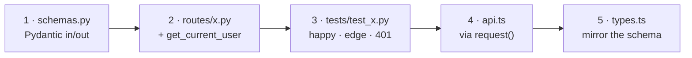

[← Docs index](README.md)

# 8. Testing & workflow

---

## 8.1 Running the tests

```powershell
cd backend
.venv\Scripts\python -m pytest                         # everything
.venv\Scripts\python -m pytest tests/test_trades.py    # one file
.venv\Scripts\python -m pytest -k "fulfil" -v          # by name
.venv\Scripts\python -m pytest -x -q                   # stop at first failure

cd frontend
npm test                                                # vitest run
npm test -- lib/trade.test.ts                           # one file
npm run build                                           # tsc -b + vite build — the type gate
```

**Two pre-existing failures** are unrelated to any current work and were inherited:

| Test | Symptom |
|---|---|
| `backend/tests/test_ingest_official.py::test_map_card_normalizes_gallery_fields` | Expects id `UNL-047-219`, mapper yields `UNL-047` |
| `frontend/src/lib/price.test.ts` | `formatPctChange(0)` expects `"+0.0%"` |

If your run shows exactly these two, you haven't broken anything. Anything else is yours.

---

## 8.2 What's covered where

| Suite | Covers |
|---|---|
| `tests/test_api.py` | Card listing, filters, inventory mutations, clamping |
| `tests/test_limits.py` | Limit resolution order, rules persistence |
| `tests/test_community.py` | Directory stats, foreign collection shape, 404, 401 |
| `tests/test_trades.py` | Format round-trip, lenient parsing, preview, fulfil clamping + isolation |
| `tests/test_excel_backup.py` | Workbook build, coercion, round-trip |
| `tests/test_pricing.py` | Budget accounting, staleness, trend math |
| `tests/test_decks.py` | Decklist parsing and name resolution |
| `tests/test_ingest_official.py` | Gallery field mapping, image-download safety |
| `src/lib/*.test.ts` | All pure frontend logic |

There are **no frontend component tests** — vitest runs in a `node` environment with no
jsdom. That is the deal behind the `lib/` convention: keep logic pure and it's trivially
tested; leave it in a component and it isn't tested at all.

---

## 8.3 Writing backend tests

`conftest.py` gives you a `client` fixture with a fresh temp database, seeded demo cards,
and `testuser` already authenticated.

```python
def test_increment_never_goes_negative(client):
    client.patch("/api/inventory/UNL-003", json={"count": 1})
    client.post("/api/inventory/UNL-003/increment?delta=-5")
    card = next(c for c in client.get("/api/cards").json() if c["id"] == "UNL-003")
    assert card["count"] == 0
```

**A second user** — copy the `_register()` helper from `tests/test_community.py`:

```python
def _register(client, username):
    client.post("/api/auth/register", json={"username": username, "password": "secret1"})
    resp = client.post("/api/auth/token", json={"username": username, "password": "secret1"})
    return {"Authorization": f"Bearer {resp.json()['access_token']}"}

def test_one_user_cannot_affect_another(client):
    bob = _register(client, "bob")
    client.patch("/api/inventory/UNL-003", json={"count": 3}, headers=bob)
    # testuser (the fixture's default header) is untouched
    mine = next(c for c in client.get("/api/cards").json() if c["id"] == "UNL-003")
    assert mine["count"] == 0
```

**The unauthenticated path** — every new protected endpoint deserves one:

```python
def test_requires_auth(client):
    client.headers.pop("Authorization", None)
    assert client.get("/api/your/new/endpoint").status_code == 401
```

Seed cards you can rely on: `UNL-003` ("Mosstomper"), `UNL-011` ("Baron Pit"). Check
`ingest/seed.py` before hard-coding a name — a guessed name has cost real debugging time
here.

---

## 8.4 Writing frontend tests

Pure functions, no DOM:

```ts
import { describe, expect, it } from "vitest";
import { setSelection } from "./trade";

describe("setSelection", () => {
  it("clamps to what the owner holds", () => {
    const m = setSelection(new Map(), "UNL-003", "normal", 99, 3);
    expect(m.get("UNL-003")).toEqual({ normal: 3, foil: 0 });
  });

  it("drops the entry when both finishes hit zero", () => {
    const m = setSelection(new Map([["X", { normal: 1, foil: 0 }]]), "X", "normal", 0, 3);
    expect(m.has("X")).toBe(false);
  });
});
```

If a behaviour you want to test needs a component, that's a signal the logic belongs in
`lib/`.

**Needing a browser API is not that signal** — stub it. The env is `node`, so
`sessionStorage`, `localStorage` and friends don't exist; `persistentState.test.ts` has an
`installStorage()` helper worth copying:

```ts
vi.stubGlobal("sessionStorage", fakeStorage);
// ...
afterEach(() => vi.unstubAllGlobals());
```

That test also shows the shape to aim for with a hook: put the decisions in plain
functions (`readPersisted`, `writePersisted`, `clearPersistedView`), test those, and leave
the hook as a thin `useState` wrapper.

---

## 8.5 Adding an endpoint — the five-file checklist



**1 · `schemas.py`** — request and response models. Every field you want in the response
must be declared here or FastAPI strips it.

**2 · `routes/<domain>.py`** — new domain? New module, then add it to
`routes/__init__.py` **and** the router loop in `main.py`. Always:

```python
current_user: User = Depends(get_current_user)
```

and filter/target every query on `current_user.id`. Mutations return the updated resource.

**3 · `tests/test_<domain>.py`** — happy path, edge cases, `401` without auth, and — if it
writes user data — a cross-user isolation test.

**4 · `frontend/src/api.ts`** — one typed function, through `request()`. Never a bare
`fetch`.

**5 · `frontend/src/types.ts`** — mirror the Pydantic model by hand. There is no
codegen; if you skip this, TypeScript happily believes a wrong shape.

Then: `pytest`, `npm test`, `npm run build`.

---

## 8.6 Adding a database column

See [data model § migrations](03-data-model.md#35-migrations). In short:

1. `mapped_column(...)` on the model, with `default=` and `server_default=` if `NOT NULL`.
2. A guarded `ALTER TABLE ... ADD COLUMN` in `main._migrate()`.
3. The Pydantic schema, if it appears in a response.
4. `types.ts`, if the frontend reads it.

**Additive only.** No drops, no renames, no type changes.

---

## 8.7 Review checklist

Before you open a PR:

- [ ] Every query touching user data filters on `current_user.id`
- [ ] No user id reaches the DB from a request body or path (except the one read-only
      community route)
- [ ] New response fields are in the `response_model` **and** in `types.ts`
- [ ] New API calls go through `api.ts`'s `request()`
- [ ] Migrations are additive and `PRAGMA`-guarded
- [ ] New pure logic lives in `lib/` or a plain backend module, with tests
- [ ] New view state a user would hate to lose is in the hash or `usePersistedState`, not
      a bare `useState` — and reload actually restores it (press F5; that's the same event
      as a phone discarding the backgrounded tab)
- [ ] `pytest` shows only the two known pre-existing failures
- [ ] `npm test` shows only the one known pre-existing failure
- [ ] `npm run build` is clean (this is the TypeScript gate)
- [ ] UI changes checked at a narrow viewport — `.card-tile` clips, so rows must wrap

---

## 8.8 Debugging tips

**"Is the backend running?" banner** — `App.tsx` shows it when `fetchCards()` rejects.
Check uvicorn, then the Vite proxy target.

**Logged out unexpectedly** — something returned 401 and `request()` cleared the token and
handed off to `App`'s logout. Common causes: token expired (30 days), `data/secret.key`
changed or was wiped, or `RIFTBOUND_DATA_DIR` moved. Note the page no longer reloads, so
the network tab keeps the failing request — look there for which endpoint 401'd.

**Back on the wrong screen after a reload** — the tab comes from `location.hash` and the
rest of the view from `sessionStorage`. Check the URL actually reads `/#/collection`; if
it's a bare `/`, the `tab` → hash effect in `App.tsx` isn't running. Filters not sticking
usually means the screen is missing its `persistKey`, or you're in a *new* browser tab
(sessionStorage is per-tab by design). Storage is also unavailable in Safari private mode,
where `usePersistedState` degrades to plain `useState` on purpose.

**A field is `undefined` on the frontend but present in the route's return value** —
it's missing from the `response_model`. This is the single most common gotcha in this
codebase. Confirm against <http://localhost:8000/docs>, which shows the *serialized*
schema.

**Counts jump back after a click** — the debounced PATCH failed and `Collection.tsx`
reverted. The error is in the browser console.

**A route 404s that shouldn't** — check declaration order. In `routes/prices.py`,
`/status` and `/summary` must be declared before `/{card_id}` or the path parameter
swallows them.

**Layout looks fine locally but clips in a screenshot** — you measured before
`Press Start 2P` loaded. Gate on `document.fonts.ready`; a fallback monospace is ~40%
narrower per glyph and will lie to you.

**Inspect the DB directly:**

```powershell
cd backend
.venv\Scripts\python -c "import sqlite3; d=sqlite3.connect('data/riftbound.db'); print(d.execute('SELECT user_id, card_id, count, foil_count FROM inventory LIMIT 10').fetchall())"
```

---

Next: [Known issues →](09-known-issues.md)
