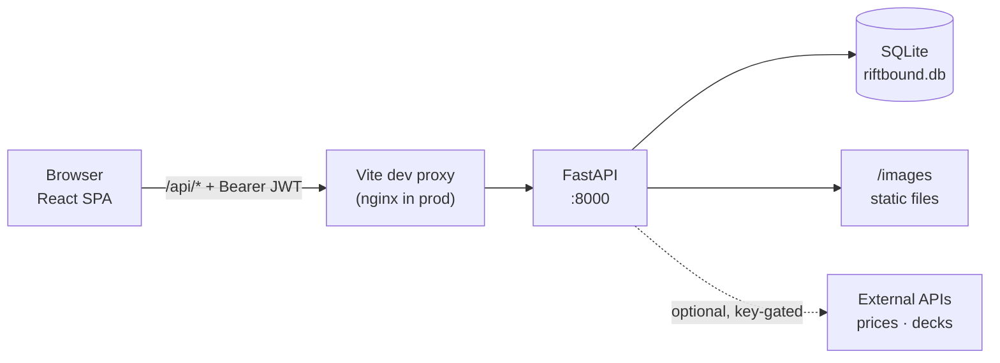

# Riftbound Inventory — Engineering Onboarding

Welcome. This is everything you need to be productive on this codebase.

Riftbound Inventory is a **self-hosted, multi-user card collection tracker** for the
Riftbound TCG. You register an account, record how many copies of each card you own,
build decks, browse other collectors' shelves, and trade cards with them.

```
Python 3.10+ · FastAPI · SQLAlchemy 2.0 · SQLite
TypeScript · React 18 · Vite · vitest
```

---

## Read these in order

| # | Document | What it covers | Read it when |
|---|---|---|---|
| 1 | [Getting started](01-getting-started.md) | Run the stack locally in ~10 minutes | Day 1, first thing |
| 2 | [System design](02-system-design.md) | Architecture, request lifecycle, why each choice was made | Day 1, before your first PR |
| 3 | [Data model](03-data-model.md) | Every table, the per-user scoping invariant, migrations | Before touching the DB |
| 4 | [Authentication](04-authentication.md) | JWT flow end to end, password hashing, what's protected | Before touching any route |
| 5 | [API reference](05-api-reference.md) | Every `/api/*` endpoint, request/response shapes | Constantly |
| 6 | [Frontend guide](06-frontend.md) | State ownership, component map, CSS conventions | Before touching the UI |
| 7 | [Feature deep dives](07-feature-deep-dives.md) | Limits engine, trades, pricing, decks, backup, ingest | When you pick up a ticket in that area |
| 8 | [Testing & workflow](08-testing-and-workflow.md) | How to test, review checklists, adding an endpoint | Before opening a PR |
| 9 | [Known issues](09-known-issues.md) | Confirmed bugs — good first tickets | When you want something to fix |

**Visual overview:** [`architecture.html`](architecture.html) is a self-contained,
interactive architecture diagram (pan/zoom, search, light/dark). Open it in a browser;
GitHub shows it as source, not rendered.

---

## The 60-second mental model



- **One SQLite file** holds everything: the card catalog, every user's counts, settings,
  decks, and price history.
- **One JSON response drives the whole collection UI.** `GET /api/cards` returns every
  card already joined with *your* counts and *your* effective limits. The frontend
  filters and sorts client-side; there is no pagination.
- **The browser only ever talks to one origin.** In dev, Vite proxies `/api` and
  `/images` to the backend. In prod, nginx does. No cross-origin requests, no API base
  URL baked into the bundle.
- **Every route except `/api/auth/*` requires a JWT** and is scoped to the caller.
- **The browser holds all view state.** The active tab is in the URL hash, filters and
  drill-downs are in `sessionStorage`, the token is in `localStorage`. A reload — or a
  phone discarding the backgrounded tab, which is the same event — resumes where you were.

---

## Where the code lives

```
riftbound-inventory/
├── CLAUDE.md                    Repo conventions (also read by AI tooling)
├── README.md                    User-facing setup + design rationale
├── docker-compose.yml           Dev + prod stacks (keys come from .env)
├── .env.example                 Template for optional API keys → copy to .env (gitignored)
├── docs/                        ← you are here (architecture.html = diagram)
│
├── backend/
│   ├── conftest.py              Pytest fixture: temp DB + auto-authenticated client
│   ├── requirements.txt
│   ├── app/
│   │   ├── main.py              App factory, migrations, router wiring
│   │   ├── config.py            Every environment variable, in one place
│   │   ├── db.py                Engine + session factory
│   │   ├── deps.py              get_db, card_to_out
│   │   ├── models.py            All 9 ORM tables
│   │   ├── schemas.py           All Pydantic models — the API contract
│   │   ├── auth.py              Hashing, JWT, get_current_user
│   │   ├── limits.py            Collection-limit rules engine
│   │   ├── trades.py            Trade-request text format (writer + parser)
│   │   ├── routes/              One module per domain
│   │   │   └── decks/           Deck import/save + external providers
│   │   ├── pricing/             Market price integration + daily budget
│   │   └── ingest/              Card catalog scrapers + demo seeder
│   └── tests/                   Pytest, one file per domain
│
└── frontend/
    ├── vite.config.ts           Dev proxy + vitest config
    ├── nginx.conf               Prod reverse proxy
    └── src/
        ├── App.tsx              Root: auth gate, hash-routed tab shell, cards state
        ├── auth.ts              Token storage + login/register
        ├── api.ts               Every HTTP call, typed
        ├── types.ts             TS mirrors of the Pydantic schemas
        ├── styles.css           The entire stylesheet
        ├── screens/             One per tab + Login
        ├── components/          MultiSelect, TradeImport
        └── lib/                 Pure logic, all unit-tested
                                 (incl. hashRoute + persistentState)
```

---

## House rules (the short version)

1. **Scope every query to `current_user.id`.** This is the invariant the whole
   multi-user model rests on. Never take a user id from a request body or path.
2. **Response models are the contract.** A field missing from a `response_model` is
   silently stripped by FastAPI. This has already shipped one live bug — see
   [known issues](09-known-issues.md).
3. **Migrations are additive-only**, hand-written in `main._migrate()` and guarded by
   `PRAGMA table_info`. Never drop or rewrite a column.
4. **Pure logic goes in a testable module** — `frontend/src/lib/` or a plain backend
   module — not inside a component or a route handler.
5. **New endpoint? Five files.** Schema → route → `api.ts` → `types.ts` → test. The
   checklist is in [testing & workflow](08-testing-and-workflow.md).
